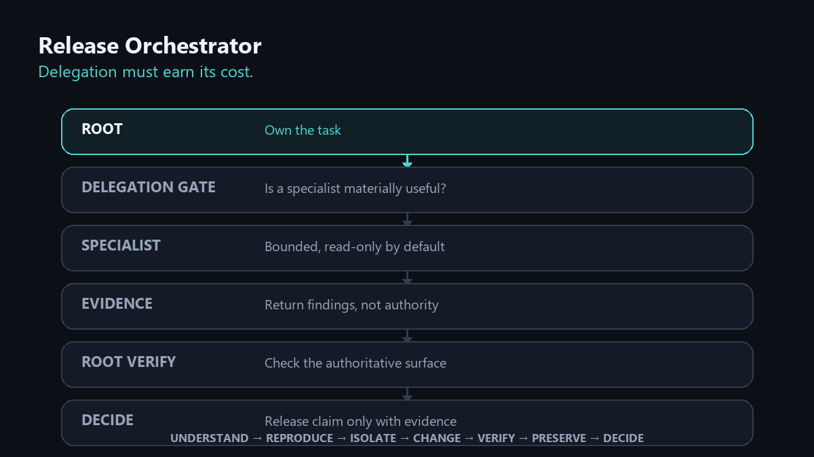

# Release Orchestrator

> **Ship with evidence, not agent confidence.**

A provider-agnostic Agent Skill for release engineering, debugging, incident response, and high-risk code changes.

Release Orchestrator teaches an AI coding agent **when not to delegate**, how to isolate specialist work, how to protect existing behavior, and how to require evidence before declaring work fixed or release-ready.

It follows the open `SKILL.md` Agent Skills convention rather than depending on a specific model or vendor.

## 30-second start

Preview the skill with the GitHub CLI:

```bash
gh skill preview Marcusvrg23/release-orchestrator release-orchestrator
```

Install it into a supported agent host:

```bash
gh skill install Marcusvrg23/release-orchestrator release-orchestrator
```

Then ask your coding agent to use `release-orchestrator` on a release blocker, risky fix, incident, or high-consequence code change.

### See the protocol in 10 seconds



## Why this exists

Multi-agent coding can be powerful, but indiscriminate fan-out creates duplicated investigation, context bloat, conflicting edits, and false confidence.

Release Orchestrator uses a different default:

```text
TASK
  |
  v
ROOT AGENT
  |
  +-- Is delegation materially useful? -- no --> solve directly
  |
 yes
  v
BOUNDED SPECIALIST(S)
  |
  v
EVIDENCE
  |
  v
ROOT VERIFICATION
  |
  v
MINIMAL CHANGE -> TARGETED TESTS -> RELEASE DECISION
```

> **More agents are not automatically more intelligence. Delegation must earn its cost.**

## Not another release automation script

Many tools named "release orchestrator" automate version bumps, changelogs, deployment pipelines, or release packets. This project solves a different problem: **how an AI coding agent should coordinate work and prove release-sensitive claims.**

Use it when the hard part is deciding whether to delegate, containing blast radius, validating a risky change, reconciling conflicting evidence, or determining whether a candidate is actually ready.

## Core principles

- **Root-only by default.** Do not spawn another agent unless it has a distinct evidence-producing role.
- **Evidence over consensus.** A worker saying `fixed` is not proof.
- **Provider agnostic.** The core skill never depends on a model slug or vendor.
- **Capability aware.** The workflow adapts to tools the host actually exposes.
- **Minimal blast radius.** Preserve existing behavior and prefer the smallest viable change.
- **Progressive validation.** Targeted checks first; broaden only when risk, failures, or unresolved concerns justify it.
- **Explicit authority.** Destructive, production, financial, publication, merge, and deploy actions remain subject to user authorization and host permissions.
- **Context efficient.** Detailed contracts live in references and are loaded only when needed.

## Portable skill bundle

```text
skills/release-orchestrator/
├── SKILL.md
├── LICENSE.txt
├── agents/
│   └── openai.yaml
└── references/
    ├── delegation.md
    ├── evidence.md
    ├── release-gates.md
    └── model-routing.md
```

The bundle is intentionally self-contained. Provider-specific setup lives outside it in [`adapters/`](adapters/).

## Capability gate

Before orchestrating, determine which capabilities are actually available:

```text
READ_FILES
WRITE_FILES
RUN_COMMANDS
USE_GIT
SPAWN_AGENTS
ISOLATE_WORKERS
BROWSE
ACCESS_RUNTIME
```

Unknown capabilities are treated as unavailable until the runtime proves otherwise.

If subagents are unavailable, Release Orchestrator works as a single-agent release protocol. If isolated worktrees, branches, sandboxes, or equivalent mechanisms exist, carefully scoped parallel work can be enabled when it materially improves the task.

## Model routing without vendor lock-in

The skill uses capability tiers instead of provider model names:

| Tier | Use for |
|---|---|
| `FAST` | deterministic search, file discovery, logs, simple checks |
| `BALANCED` | normal investigation, implementation analysis, targeted review |
| `STRONG` | difficult coding, substantial investigation, synthesis |
| `FRONTIER` | high ambiguity or consequence: security, architecture, payments, finance, release risk |

Each host or user maps those tiers to models currently available in that environment. See [`skills/release-orchestrator/references/model-routing.md`](skills/release-orchestrator/references/model-routing.md).

## Host compatibility

The core uses the open Agent Skills convention. Current adapters cover:

- OpenAI Codex
- Claude Code
- Gemini CLI / Google agent environments
- Cursor
- GitHub Copilot
- generic chat/API/local-agent runtimes

Host capabilities differ. Release Orchestrator never assumes that every host can spawn subagents, run commands, use Git, browse, or edit files.

See [`adapters/`](adapters/) and [`docs/compatibility.md`](docs/compatibility.md) for current installation paths and host-specific notes.

## Install

Use the canonical `skills/release-orchestrator/` directory.

For hosts that discover `.agents/skills`, copy or link it to:

```text
.agents/skills/release-orchestrator/
```

Other hosts may use their own skill directories. Follow the matching adapter.

## Invoke

Explicit invocation is recommended for release-sensitive work:

```text
Use the release-orchestrator skill to diagnose this release blocker.
Preserve existing behavior, delegate only if the delegation gate passes,
and do not deploy or merge without my approval.
```

## What it does not do

Release Orchestrator is not a deployment platform, CI service, security scanner, or autonomous permission bypass. It does not grant an LLM capabilities its runtime does not expose.

It also does not guarantee correctness. It provides a disciplined process for producing and validating evidence before high-confidence claims are made.

## Origin

The project was generalized from an internal release-orchestration workflow used while shipping a production application. The public version contains no customer source code, credentials, databases, uploaded documents, or private application data.

## Status

`v1.0.1` is the current release. See [`CHANGELOG.md`](CHANGELOG.md) and [`RELEASE_NOTES.md`](RELEASE_NOTES.md).

## License

MIT. See [`LICENSE`](LICENSE).
